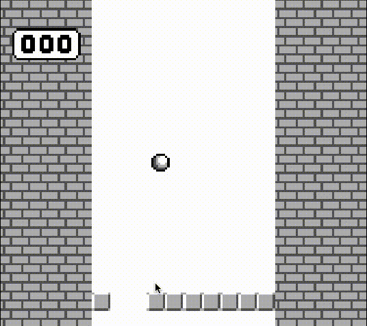

# DodgeBlocks

A classic endless runner game for the Nintendo Game Boy, built with GBDK (Game Boy Development Kit).

## Download
[](../../releases/latest)

## Game Description

DodgeBlocks is an arcade-style dodge game where you control a ball that must avoid oncoming blocks. Navigate left and right to pass through gaps in the block formations as they scroll up the screen.

## Gameplay



## Controls

- **Left/Right D-pad**: Move the ball horizontally
- **START**: Restart the game after game over

## Building the Game

### Prerequisites

- GBDK (Game Boy Development Kit) installed in `../gbdk/` relative to the project directory
- Make utility

### Build Instructions

1. Clone or download this repository
2. Ensure GBDK is installed in the correct path (`../gbdk/`)
3. Run the build command:

```bash
make
```

4. The compiled Game Boy ROM will be created as `build/main.gb`

### Clean Build Files

```bash
make clean
```

## File Structure

```
DodgeBlocks/
├── main.c              # Main game logic and loop
├── ballSprite.c/.h     # Ball sprite graphics data
├── textTiles.c/.h      # Number tiles and background graphics
├── makefile            # Build configuration
└── README.md           # This file
```


## Running the Game

The compiled `main.gb` file can be run on:
- Original Game Boy hardware with a flash cartridge
- Game Boy emulators (BGB, Visual Boy Advance, SameBoy, etc.)
- Game Boy Color and Game Boy Advance (backward compatible)
